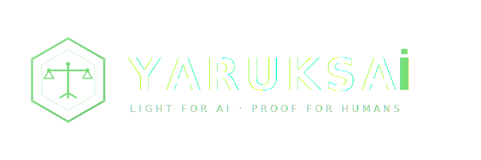

# YARUKSAİ — Ethical AI Decision Engine

<p align="center">
  
</p>

<p align="center">
  <strong>Light for AI · Proof for Humans</strong>
</p>

<p align="center">
  <a href="https://yaruksai.com">Website</a> ·
  <a href="https://yaruksai.com/ops-room">Live Demo</a> ·
  <a href="#architecture">Architecture</a> ·
  <a href="#quick-start">Quick Start</a>
</p>

---

## What is YARUKSAİ?

YARUKSAİ is an **AI ethics engine** that audits AI decisions through a multi-agent council, seals every verdict with SHA-256 cryptographic proof, and generates EU AI Act compliance reports — automatically.

**The problem:** AI systems make decisions that affect people's lives (credit scoring, hiring, medical diagnosis). These decisions are opaque, unauditable, and legally indefensible.

**The solution:** YARUKSAİ interposes a **7-agent ethical council** between the AI decision and execution. Each agent independently scores the decision. The consensus is cryptographically sealed and stored as tamper-proof evidence.

### Key Features

| Feature | Description |
|---------|-------------|
| 🏛️ **7AI Shūrā Council** | 7 independent agents evaluate every decision |
| ⚖️ **Mizan Engine** | Deterministic Python scoring (no LLM hallucination) |
| 🔐 **SHA-256 Seal Chain** | Every decision is cryptographically sealed |
| 🛡️ **Kill-Switch** | σ < 0.30 → automatic halt (9ms response) |
| 📋 **EU AI Act Reports** | Auto-generated compliance reports (Articles 5-15) |
| 🧠 **Agent Memory** | SQLite-based collective memory for learning |
| 💾 **Checkpoint System** | Pipeline survives crashes and OOM kills |
| 🏠 **Local-First** | Runs entirely on-premise with Ollama |

---

## Architecture

```
User (Browser)
    ↓ HTTPS
Cloudflare (CDN + SSL)
    ↓
Nginx (Reverse Proxy)
    ↓
┌─────────────────────┐     ┌──────────────────────┐
│  TS Engine (:3000)  │────→│  Python Pipeline     │
│  - 7AI Council      │     │  (:8001, FastAPI)    │
│  - API Gateway      │     │  - 6 Stage CrewAI    │
│  - SHA-256 Sealing  │     │  - Groq/Ollama LLM   │
│  - Bridge → Python  │     │  - SSE Streaming     │
└─────────────────────┘     │  - EU AI Act Reports │
                            │  - Agent Memory      │
                            └──────────────────────┘
                                     ↓
                              Ollama (:11434)
                              Local LLM (gemma3:1b)
```

### 6-Stage Pipeline

```
ARCHITECT → AUDITOR → MIZAN → BUILDER → POST-AUDIT → FINAL GATE
    ↓          ↓        ↓        ↓          ↓            ↓
 Design    Review   Score    Execute    Validate     Approve/
 Plan      Risks    Quality   Plan     Security      Reject
```

---

## Quick Start

### Prerequisites

- Docker & Docker Compose
- [Ollama](https://ollama.ai) (for local LLM)

### 1. Clone & Setup

```bash
git clone https://github.com/user/yaruksai.git
cd yaruksai

# Pull the local LLM model
ollama pull gemma3:1b

# Copy env template
cp .env.example .env
```

### 2. Run

```bash
docker compose up -d
```

### 3. Access

- **Ops Room:** http://localhost:3000/ops-room
- **API:** http://localhost:3000/api/pipeline/trigger
- **Memory:** http://localhost:8001/api/memory/stats

---

## API Reference

### Trigger Pipeline
```bash
curl -X POST http://localhost:3000/api/pipeline/trigger \
  -H "Content-Type: application/json" \
  -d '{
    "goal": "Evaluate credit scoring algorithm",
    "narrative": "Fair lending compliance check",
    "action_id": "credit-audit-001",
    "raw_metrics": {
      "fayda": 0.8,
      "seffaflik": "FULL_SYNC",
      "sozlesme": "ACTIVE",
      "mucbir_sebep": "NONE",
      "israf": 0.1
    }
  }'
```

### Response
```json
{
  "status": "pipeline_started",
  "sigma": 0.8606,
  "verdict": "APPROVE",
  "run_id": "run_abc123...",
  "stream_url": "/api/pipeline/stream/run_abc123...",
  "council_seal": "7e3c98d2..."
}
```

### Memory Search
```bash
curl "http://localhost:8001/api/memory/search?q=credit+scoring"
```

### Download Hakikat Paketi (Evidence ZIP)
```bash
curl -O "http://localhost:8001/api/pipeline/artifacts/run_abc123/download"
```

---

## EU AI Act Compliance

YARUKSAİ automatically generates compliance reports mapping to:

| Article | Check | 
|---------|-------|
| Article 5 | Prohibited AI Practices (Kill-Switch) |
| Article 9 | Risk Management System |
| Article 10 | Data & Data Governance |
| Article 11 | Technical Documentation |
| Article 12 | Record-Keeping (SHA-256 Logs) |
| Article 13 | Transparency |
| Article 14 | Human Oversight |
| Article 15 | Accuracy, Robustness & Cybersecurity |

---

## Cost

| Component | Monthly Cost |
|-----------|-------------|
| Hetzner CX22 | €4 |
| Ollama (local) | €0 |
| Cloudflare (free) | €0 |
| **Total** | **€4/month** |

---

## License

Apache License 2.0 — see [LICENSE](LICENSE)

---

## Contributing

We welcome contributions! Please see [CONTRIBUTING.md](CONTRIBUTING.md).

---

<p align="center">
  <sub>Built with ⚖️ by the YARUKSAİ team — <i>"Acımasız Gerçeklik"</i></sub>
</p>
